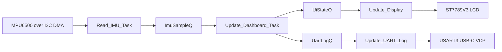

# RTOS Multi-Sensor Dashboard

      

STM32 **FreeRTOS** demo firmware that reads an MPU6500 IMU, updates an ST7789V3 LCD,
and streams the same sensor data over the board's USB-C virtual COM port while keeping a LED HeartBeat. 

Uses I2C, SPI, UART, DMA, Mutexes, Tasks, Queues, Semaphores and an NVIC -> ISR

## Demo Video 

https://github.com/user-attachments/assets/8d01808f-3e3d-4925-8c8a-ecf3500c826f


## What This Demonstrates

- CMSIS-RTOS2/FreeRTOS task creation and periodic task timing.
- Queue-based data handoff between tasks.
- A binary **semaphore** released from a DMA completion callback for **UART** and **I2C**.
- A **mutex** protecting shared LCD drawing access.
- Custom board "glue" for an MPU6500 driver and an ST7789V3 display driver.

## Hardware

- MPU6500 IMU over I2C1 with GPDMA receive completion
- 1.47 inch ST7789V3 LCD over SPI1
- USART3 on the USB-C virtual COM port for UART logging

ST board reference: [STM32H5 Nucleo-64 user manual](https://www.st.com/resource/en/user_manual/um3121-stm32h5-nucleo64-board-mb1814-stmicroelectronics.pdf)

## RTOS Data Flow



The main RTOS application lives in `Core/Src/app_freertos.c`.

- Queue: `ImuSampleQ`, `UiStateQ`, and `UartLogQ` pass sensor data between tasks.
- Semaphore: `IMUDmaDoneSem` lets the IMU task wait for I2C DMA completion.
- Mutex: `ScreenMutex` protects ST7789V3 drawing calls.

`Core/Src/main.c` keeps the CubeMX peripheral setup and the board-specific driver
callbacks. `Custom_Drivers/` contains the reusable MPU6500 and ST7789V3 driver
code used by the RTOS application.

## Build

This project uses the CMake presets generated for the STM32 toolchain.

```powershell
cmake --preset Debug
cmake --build --preset Debug
```

Flash the resulting firmware with STM32CubeProgrammer, STM32CubeIDE, or your
normal ST-LINK workflow.

## Demo Behavior

When running on hardware:

- The display shows live accelerometer and gyroscope values.
- The UART log task prints the same values over USART3 at 115200 baud.
- The IMU task samples on a fixed 10 ms period using `osDelayUntil`.

